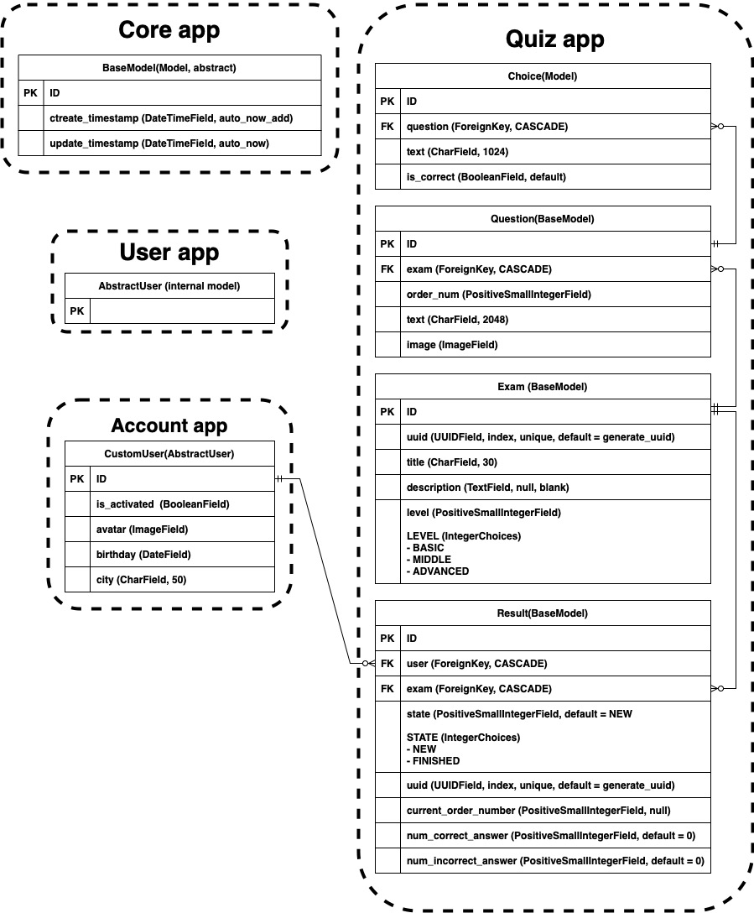

# Django QUIZ

## Технические требования  
### Web-UI
  1. Регистрация
      - [x] регистрация (с подтверждением по email)
      - [x] авторизация
      - [x] смена пароля
      - [x] сброс пароля
    
  2. Возможности пользователя
      - прохождение любого теста
      - последовательно проходить вопросы теста (один за другим)
      - завершение отложенного теста
      - удаление незавершенного теста 
      - просмотр результатов
    
  3. После завершения теста
      - отчет о ко-ве правильных и неправильных ответов
      - процент правильных ответов

### Admin site
  1. Управление пользователями
  2. Управление тестами
      - [x] добавление теста
      - [x] изменить тест
      - [x] удаление теста
      - [x] валидация теста
        - нельзя сохранить вопрос:
            - [x] без указания правильного ответа
            - [x] в которых все ответы правильные
        - нельзя сохранить тест если:
            - [ ] некорректный order_num (должен быть от 1 до 100 и увеличиваться на 1)
            - [ ] максимальное значение order_num не более максимально допустимого кол-ва вопросов
            - [x] кол-во вопросов менее 3 или более 100

### Дополнительные требования
1. [x] Проект должен быть на Git-е
2. [x] Наличие файла requirements.txt
3. [x] venv
4. [ ] PostgreSQL
5. [ ] Наличие дампа данных
6. [ ] bootstrap
7. [ ] API + Tests
8. [ ] Docker image
9. [ ] Кэширование 
10. [ ] Планировщик
11. [ ] Деплой на Amazon

## DB - Schema
